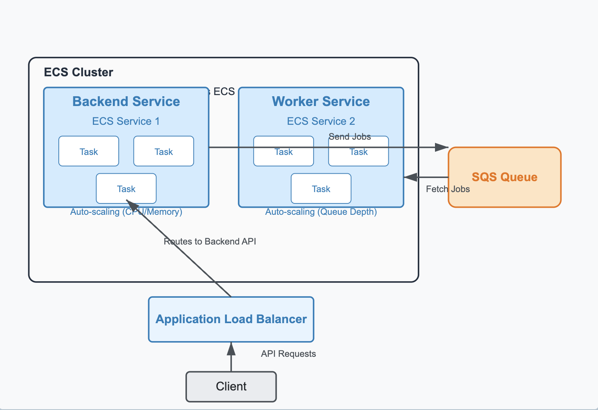

# MeritPath

MeritPath is a platform that helps researchers track and analyze their citations and discover potential collaborators through citation networks.

## System Architecture

Our system uses a containerized architecture built on AWS ECS for scalable processing of both synchronous requests and asynchronous tasks.

### Components

#### Containerized Services
- **Backend Service (ECS Service 1)**: 
  - Handles API requests, authentication, and business logic
  - Sends jobs to SQS for background processing
  - Auto-scales based on CPU/memory usage during traffic spikes

- **Worker Service (ECS Service 2)**: 
  - Processes resource-intensive background jobs
  - Fetches tasks from SQS queue
  - Auto-scales based on queue depth for efficient processing

#### Infrastructure
- **Application Load Balancer**: Routes client requests to the Backend Service, providing SSL termination and high availability.

- **SQS Queue**: Enables asynchronous communication between services, allowing the Backend Service to offload intensive tasks to the Worker Service.

- **Frontend Applications**: NextJS-based web applications that interact with our system through the Backend Service API.

### Database Architecture

Our normalized database schema efficiently stores citation relationships while supporting asynchronous processing workflows:

to be updated

### Real-time Updates with Supabase

We leverage Supabase for data persistence and real-time updates:

- **Database as a Service**: Supabase provides a PostgreSQL database with robust security features and API access.

- **Real-time Subscriptions**: Our frontend subscribes to database changes, enabling live updates when:
  - Job statuses change (pending → processing → completed)
  - New citation data becomes available
  - User profile information is updated

- **Authentication Integration**: Seamless integration between Supabase Auth and our application permissions.

### System Benefits

This architecture provides several advantages:
- **Separation of concerns**: Immediate request handling is decoupled from resource-intensive background processing
- **Independent scaling**: Different components scale based on their specific workloads
- **High availability**: AWS managed services provide reliability and fault tolerance
- **Efficient data management**: Normalized database design enables precise querying with minimal joins
- **Real-time capabilities**: Supabase subscriptions provide instant UI updates without polling

## Development

[Add development setup instructions here]

## Deployment

[Add deployment instructions here]